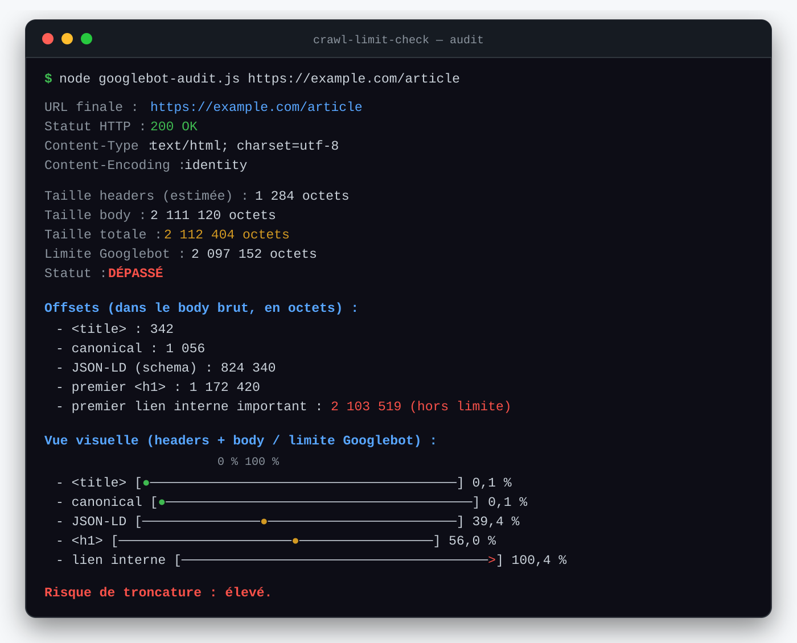

# crawl-limit-check

CLI Node.js d'audit SEO technique pour mesurer une ressource HTML face à la
limite de récupération de **2 Mio de Googlebot** et vérifier que ses signaux
d'indexation essentiels apparaissent avant la coupure.



## Pourquoi ce projet ?

Googlebot ne transmet à ses systèmes d'indexation que les premiers
**2 097 152 octets** d'une ressource prise en charge. La limite est appliquée
aux données non compressées. Sur une page volumineuse, un élément placé trop
loin dans le flux HTML peut donc ne jamais atteindre les étapes de rendu et
d'indexation.

`crawl-limit-check` rend ce risque observable depuis un terminal. L'outil ne se
contente pas de mesurer la réponse : il positionne les principaux signaux SEO
dans le flux d'octets afin de montrer ce que Googlebot est susceptible de voir
avant la coupure.

Références : [documentation Googlebot](https://developers.google.com/search/docs/crawling-indexing/googlebot) et [explication du fonctionnement de la limite](https://developers.google.com/search/blog/2026/03/crawler-blog-post).

## Fonctionnalités

- requêtes HTTP et HTTPS avec les modules natifs de Node.js ;
- désactivation explicite de la compression avec `Accept-Encoding: identity` ;
- récupération du body sous forme de `Buffer`, sans transformation implicite ;
- reconstruction et estimation de la taille des headers HTTP de réponse ;
- suivi d'une redirection HTTP ;
- détection du type de contenu et du statut HTTP final ;
- mesure de la taille des headers, du body et de la réponse complète ;
- calcul d'offsets réellement exprimés en octets, y compris avec du texte UTF-8 ;
- représentation visuelle des offsets dans le budget de 2 Mio ;
- codes de sortie exploitables dans un script ou une CI.

Les éléments SEO actuellement recherchés sont :

- `<title>` ;
- `<link rel="canonical">` ;
- premier `<script type="application/ld+json">` ;
- premier `<h1>` ;
- premier lien interne jugé important.

## Prérequis

- Node.js **18 ou supérieur** ;
- aucune dépendance npm d'exécution ;
- aucune installation globale.

Le projet utilise les ES modules via `"type": "module"` dans `package.json`.

## Démarrage rapide

Depuis la racine du dépôt :

```bash
node googlebot-audit.js https://example.com/page
```

La même commande est exposée comme script npm :

```bash
npm run audit -- https://example.com/page
```

Afficher l'aide :

```bash
node googlebot-audit.js
```

## Processus d'audit

```text
URL saisie
   │
   ▼
Validation HTTP(S)
   │
   ▼
Requête avec Accept-Encoding: identity
   │
   ├── collecte des headers de réponse
   ├── conservation du body brut dans un Buffer
   └── suivi d'une redirection au maximum
   │
   ▼
Mesure headers + body
   │
   ▼
Analyse du HTML dans une vue latin1 du Buffer
   │
   ├── title / canonical / JSON-LD
   ├── premier h1
   └── lien interne important
   │
   ▼
Rapport numérique + jauges CLI + code de sortie
```

### Pourquoi utiliser une vue `latin1` du body ?

Les index de chaînes JavaScript ne correspondent pas toujours aux octets d'un
document UTF-8. Le body est donc conservé dans un `Buffer`, puis projeté en
`latin1` uniquement pour effectuer les recherches. Chaque caractère de cette
vue représente exactement un octet. Les noms de balises et d'attributs étant en
ASCII, leurs positions restent cohérentes avec le flux binaire original.

### Convention de mesure des headers

Pour produire un indicateur reproductible côté développeur, le projet calcule
la taille auditée selon la formule suivante :

```text
headers HTTP de réponse reconstruits + body non compressé reçu
```

Cette mesure suit le périmètre fonctionnel du projet. Elle ne constitue pas une
émulation octet par octet de l'infrastructure Google : la publication technique
actuelle de Google mentionne notamment les headers de requête dans le cutoff.
Le résultat doit donc être lu comme un signal d'audit local, volontairement
documenté, et non comme une reproduction interne de Googlebot.

### Comment le lien interne important est-il choisi ?

L'analyse applique les priorités suivantes :

1. premier lien interne situé dans `<main>` ;
2. à défaut, premier lien interne situé après le premier `<h1>` ;
3. à défaut, premier lien interne détecté dans le document.

Une URL relative ou une URL absolue partageant le même hostname est considérée
comme interne. Les ancres seules et les protocoles `javascript:`, `mailto:`,
`tel:` et `data:` sont ignorés.

## Comprendre le rapport

Le rapport comporte quatre niveaux d'information :

1. **réponse HTTP** : URL finale, statut, type et encodage ;
2. **volumétrie** : headers, body, total et pourcentage du budget ;
3. **offsets SEO** : position de chaque élément dans le body brut ;
4. **diagnostic** : statut global, risque de troncature et avertissements.

La jauge représente la position `taille des headers + offset dans le body` par
rapport à la limite :

```text
                   0 %                                100 %
- <title>         [●───────────────────────────────────────] 0,0 %
- canonical       [───●────────────────────────────────────] 9,5 %
- JSON-LD         [─────────●──────────────────────────────] 23,9 %
- <h1>            [───────────────────●────────────────────] 47,7 %
- lien interne    [───────────────────────────────────────>] 100,2 %
```

- `●` : élément détecté avant la limite ;
- `>` : élément détecté au-delà de la limite ;
- `?` : élément non trouvé.

Le statut global suit les seuils suivants :

| Consommation du budget | Statut | Risque |
| --- | --- | --- |
| moins de 80 % | `OK` | faible |
| de 80 % à 100 % | `ATTENTION` | moyen |
| plus de 100 % | `DÉPASSÉ` | élevé |

## Architecture

```text
.
├── googlebot-audit.js       Point d'entrée minimal du CLI
├── package.json             Métadonnées ESM et commande npm
├── README.md                Documentation du projet
├── docs/
│   └── assets/
│       └── cli-report.svg   Capture du rapport terminal
└── src/
    ├── cli.js               Arguments, validation et orchestration
    ├── config.js            Limites, timeout et seuils partagés
    ├── http-client.js       Transport HTTP(S) et redirections
    ├── html-analyzer.js     Détection des éléments SEO et offsets
    └── report.js            Calcul des indicateurs et rendu console
```

Chaque module expose uniquement ce qui est nécessaire à l'étape suivante :

```text
googlebot-audit.js
        └── cli.js
              ├── http-client.js ── config.js
              └── report.js
                    ├── html-analyzer.js
                    └── config.js
```

Cette organisation sépare l'orchestration, les entrées-sorties réseau,
l'analyse métier et la présentation, tout en conservant une base de code assez
petite pour être parcourue rapidement.

## Gestion des erreurs et codes de sortie

| Code | Signification |
| ---: | --- |
| `0` | audit terminé sans dépassement ni anomalie majeure |
| `1` | argument invalide, protocole non pris en charge, erreur DNS/réseau ou timeout |
| `2` | limite dépassée, statut final non-200 ou contenu non HTML |

Un serveur qui ignore `Accept-Encoding: identity` est explicitement signalé.
Le body est alors conservé tel qu'il a été reçu, mais les offsets HTML ne sont
pas calculés puisqu'ils ne représenteraient pas le contenu non compressé.

## Limites connues

- L'analyse HTML repose volontairement sur des expressions régulières et ne
  remplace pas un parseur DOM complet.
- Node.js expose `rawHeaders`, mais pas les octets exacts de la section headers.
  La taille annoncée est une reconstruction HTTP/1.x incluant la ligne de statut
  et les séparateurs CRLF.
- Le body complet est conservé en mémoire afin de calculer sa taille et tous les
  offsets. L'outil est destiné à l'audit ponctuel de ressources web, pas au
  traitement continu de fichiers arbitrairement volumineux.
- Le User-Agent du CLI est `crawl-limit-check/1.0`. Un serveur pratiquant du
  cloaking ou variant fortement sa réponse selon le client peut renvoyer un HTML
  différent de celui servi à Googlebot.

## Évolutions envisagées

- sortie structurée avec une option `--json` ;
- audit par lot à partir d'un sitemap ou d'un fichier d'URLs ;
- export CSV pour les équipes SEO ;
- tests automatisés des scénarios HTTP et des offsets ;
- détection de signaux supplémentaires (`meta robots`, description, hreflang) ;
- configuration du timeout, du seuil d'alerte et du nombre de redirections.
